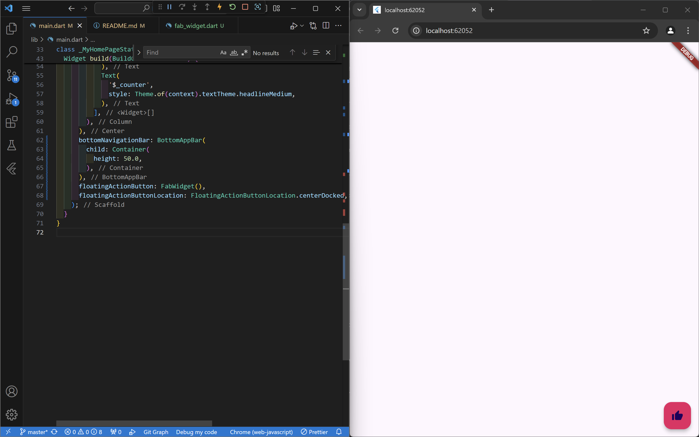

# hello_world

## Praktikum 3

## Praktikum 4
1. Text widget

2. Image widget

## Praktikum 5
1. Cupertino Button dan Loading Bar

2. Floating Action Button (FAB)

3. Scaffold Widget

4. Dialog Widget

5. Input dan Selection Widget

6. Date and Time Pickers

# Tugas Praktikum
jalankan aplikasi hello_world pada perangkat fisik (device Android/iOS) agar Anda mempunyai pengalaman untuk menghubungkan ke perangkat fisik. Capture hasil aplikasi di perangkat, lalu buatlah laporan praktikum
2. Selesaikan Codelabs: Your first Flutter app, lalu buatlah laporan praktikumnya dan push ke repository GitHub Anda!

